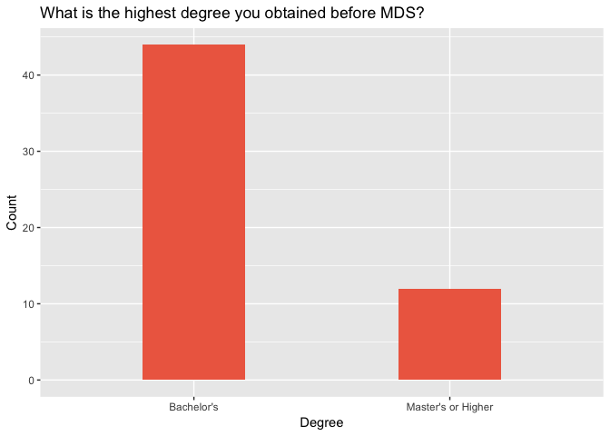
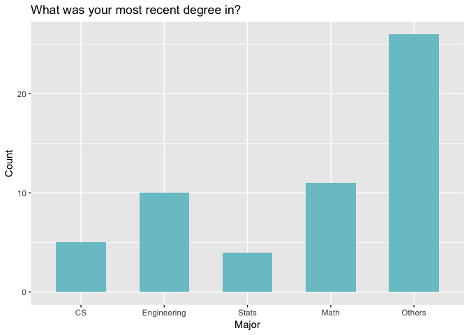
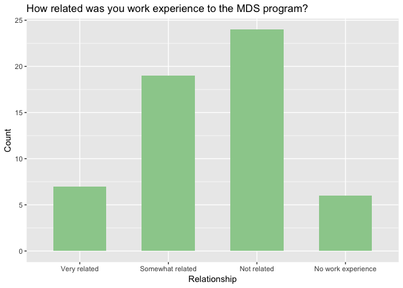
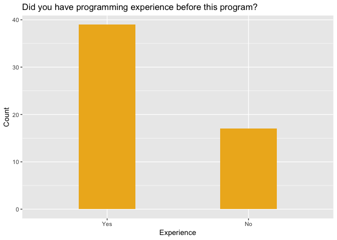
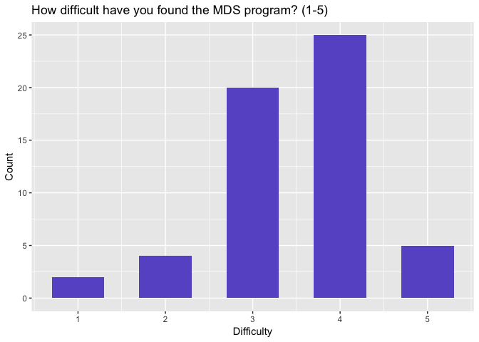

Exploratory data analysis for 554 Survey
================

``` r
suppressPackageStartupMessages(library(tidyverse))
```

Load Data
---------

``` r
# load csv: note the data is not in the github repo
df = read.csv("results-survey.csv")
# select the columns we need
df <- df %>% select(id, X1, X2, X3, X4, Y)
# display a head
head(df)
```

    ##   id X1 X2 X3 X4 Y
    ## 1  2 A2 A2 A4 A1 3
    ## 2  3 A1 A5 A4 A1 3
    ## 3  4 A1 A1 A2 A1 4
    ## 4  5 A1 A5 A1 A1 4
    ## 5  6 A1 A4 A3 A1 2
    ## 6  7 A1 A2 A2 A1 2

Variables Collected
-------------------

The data is collected from the response of our survey. Here is the decriptions of the variables.

**X1:** What is the highest degree you obtained before MDS?

-   A1: Bachelor's
-   A2: Master's or Higher

**X2:** What was your most recent degree in?

-   A1: Computer Science
-   A2: Engineering (Other than Computer Science)
-   A3: Statistics
-   A4: Mathematics (Other than Statistics)
-   A5: None of the above

**X3:** How related was you work experience to the MDS program?

-   A1: Very related - the work I did was very similar to the work I am doing in the program
-   A2: Somewhat related - the work I did was somewhat similar to the work I am doing in the program
-   A3: Not related - the work I did was not at all similar to the work I am doing in the program
-   A4: I have no previous work experience

**X4:** Did you have programming experience before this program?

-   A1: Yes
-   A2: No

**Y:** How difficult have you found the MDS program?

-   1: Very Easy
-   2: Easy
-   3: Neutral
-   4: Difficult
-   5: Very Difficult

Summary table
-------------

``` r
# summarize the data
summary(df)
```

    ##        id         X1      X2      X3      X4           Y        
    ##  Min.   : 2.00   A1:44   A1: 5   A1: 7   A1:39   Min.   :1.000  
    ##  1st Qu.:15.75   A2:12   A2:10   A2:19   A2:17   1st Qu.:3.000  
    ##  Median :29.50           A3: 4   A3:24           Median :4.000  
    ##  Mean   :29.64           A4:11   A4: 6           Mean   :3.482  
    ##  3rd Qu.:43.25           A5:26                   3rd Qu.:4.000  
    ##  Max.   :58.00                                   Max.   :5.000

Bar plots for the single variables
----------------------------------

``` r
df %>% 
  ggplot(aes(x = X1)) +
  geom_bar(width = 0.4, fill = "coral2") +
  scale_x_discrete(labels = c("Bachelor's","Master's or Higher")) +
  labs(title = "What is the highest degree you obtained before MDS?",
       x = "Degree",
       y = "Count")
```



``` r
df %>% 
  ggplot(aes(x = X2)) +
  geom_bar(width = 0.6, fill = "cadetblue3") +
  scale_x_discrete(labels = c("CS","Engineering","Stats","Math","Others")) +
  labs(title = "What was your most recent degree in?",
       x = "Major",
       y = "Count")
```



``` r
df %>% 
  ggplot(aes(x = X3)) +
  geom_bar(width = 0.6, fill = "darkseagreen3") +
  scale_x_discrete(labels = c("Very related","Somewhat related","Not related","No work experience")) +
  labs(title = "How related was you work experience to the MDS program?",
       x = "Relationship",
       y = "Count")
```



``` r
df %>% 
  ggplot(aes(x = X4)) +
  geom_bar(width = 0.4, fill = "goldenrod2") +
  scale_x_discrete(labels = c("Yes","No")) +
  labs(title = "Did you have programming experience before this program?",
       x = "Experience",
       y = "Count")
```



``` r
df %>% 
  ggplot(aes(x = Y)) +
  geom_bar(width = 0.6, fill = "slateblue") +
  labs(title = "How difficult have you found the MDS program? (1-5)",
       x = "Difficulty",
       y = "Count")
```


